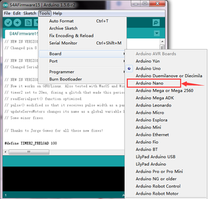

# 3、Arduino

## 3.1 Arduino介绍

什么是 Arduino?

Arduino是一款便捷灵活、方便上手的开源电子原型平台。它构建于开放原始码simple I/O介面版，并且具有使用类似Java、C语言的Processing/Wiring开发环境。主要包含两个主要的部分：硬件部分是可以用来做电路连接的Arduino电路板；另外一个则是Arduino IDE，你的计算机中的程序开发环境。你只要在IDE中编写程序代码，将程序上传到Arduino电路板后，程序便会告诉Arduino电路板要做些什么了。

## 3.2 Arduino IDE安装方法

首先，点击以下网站下载安装程序和驱动。

[https://www.arduino.cc/en/Main/OldSoftwareReleases#1.5.x](https://www.arduino.cc/en/Main/OldSoftwareReleases#1.5.x)

点击下载arduino-1.5.6-r2-windows.zip文件，解压到文件夹。

双击Arduino-1.5.6 .exe，点击“I agree”。

点击“Next”。

然后点击“Install”。

等待安装成功, 然后点击close。

安装成功显示如下图。

## 3.3 Arduino driver驱动安装方法

下面我们开始安装Arduino的驱动。

首先我们把Nano板用USB线连接在电脑上，鼠标右键点击“计算机”—\>“属性”—\>
“设备管理器”, 你可以看到“USB Serial Port”。

点击“USB Serial Port”, 选择“Update Driver software”。

在这个界面, 点击“Browse my computer for driver software”。

找到“ft232r usb uart Driver” 文件夹，点击“Next”。

安装完成，点击“Close”。

安装驱动成功，再次进入“设备管理器”。鼠标右键点击“计算机”—\>“属性”—\>
“设备管理器”, 你可以看到该Nano板对应的COM口。

## 3.4 SCRACH 和S4A软件介绍

Scratch是面向少年的简易编程工具。这个软件的特点是：使用者可以不认识英文单词，也可以不会使用键盘。构成程序的命令和参数通过积木形状的模块来实现。用鼠标拖动模块到程序编辑栏就可以了。几乎所有的孩子都会一眼喜欢上这个软件。建立起做程序的欲望。

此套件中我们主要使用S4A软件作为开发环境。S4A是使Arduino开源硬件平台能够简单编程的Scratch修改版。在S4A中，提供了一系列新的传感器模块与输出模块，并通过它们连接到你的Arduino控制器。

## 3.5 SCRACH固件安装方法

我们需要给Robotale SCRACH软件安装固件，打开S4AFirmware15程序。

设置板

设置COM口

设置成功，软件右下角有显示，和设备管理其中显示一致，点击编译程序，检查程序错误。

编译成功，点击上传程序

上传程序成功，显示如下图。

## 3.6 S4A15软件安装方法

固件安装成功后，鼠标左键双击，开始安装S4A15软件，点击Next。

选择如下图，再点击Next。

点击Next。

点击Next。

点击Next。

点击Install。

软件安装成功，点击Finish。

S4A15软件安装成功，自动进入，显示如下。

S4A15软件安装成功后，我们即可在该开发环境下编程，完成各种有趣的实验。

# 3.7、实验课程

这里大家应该对 Arduino 和 S4A
有一个初步的了解了，我们下面通过实际操作来学习这种编程软件。

## 例程 1 LED Blinking

小灯闪烁实验是比较基础的实验之一，这一课程就是我们利用S4A15软件程序实现LED灯闪烁效果。

实验器材如下

nano ch340*1

SCRACH*1

USB Cable*1

我们使用了SCRACH自带的LED灯。按照上图连接好后，就可以开始编写程序了。

\*\*\*\*\*\*\*\*\*\*\*\*\*\*\*\*\*\*\*\*\*\*\*\*\*\*\*\*\*\*\*\*\*\*\*\*\*\*\*\*\*\*\*\*\*\*\*\*\*\*\*\*\*\*\*\*\*\*\*\*\*\*\*\*\*\*\*\*\*\*\*\*\*\*\*\*\*

点击，紧接着我们就可以看到SCRACH板上D10的LED灯开始闪烁10次，点亮
0.5 秒熄灭0.5 秒，这样我们的小灯闪烁实验就完成了。

\*\*\*\*\*\*\*\*\*\*\*\*\*\*\*\*\*\*\*\*\*\*\*\*\*\*\*\*\*\*\*\*\*\*\*\*\*\*\*\*\*\*\*\*\*\*\*\*\*\*\*\*\*\*\*\*\*\*\*\*\*\*\*\*\*\*\*\*\*\*\*\*\*\*\*\*\*

## 例程 2 呼吸灯

呼吸灯实验是比较基础的实验之一，这一课程就是我们利用S4A15软件程序实现LED灯逐渐变暗和逐渐变暗的效果。

实验器材如下

nano ch340*1

SCRACH*1

USB Cable*1

我们使用了SCRACH自带的RGB灯。按照上图连接好后，就可以开始编写程序了。

\*\*\*\*\*\*\*\*\*\*\*\*\*\*\*\*\*\*\*\*\*\*\*\*\*\*\*\*\*\*\*\*\*\*\*\*\*\*\*\*\*\*\*\*\*\*\*\*\*\*\*\*\*\*\*\*\*\*\*\*\*\*\*\*\*\*\*\*\*\*\*\*\*\*\*\*\*

点击，紧接着我们就可以看到Robotale SCRACH板上RGB灯显绿色，并且改灯逐渐变亮，而后逐渐变暗，循环20次。

\*\*\*\*\*\*\*\*\*\*\*\*\*\*\*\*\*\*\*\*\*\*\*\*\*\*\*\*\*\*\*\*\*\*\*\*\*\*\*\*\*\*\*\*\*\*\*\*\*\*\*\*\*\*\*\*\*\*\*\*\*\*\*\*\*\*\*\*\*\*\*\*\*\*\*\*\*

## 例程 3 流水灯实验

这一课程中，我们利用S4A15软件程序控制3个LED灯按照设定的顺序和时间来发亮和熄灭，从而达到流水灯的视觉效果。

实验器材如下

nano ch340*1

SCRACH*1

USB Cable*1

我们使用了Robotale SCRACH自带的LED灯。按照上图连接好电路后，就可以开始编写程序了。

\*\*\*\*\*\*\*\*\*\*\*\*\*\*\*\*\*\*\*\*\*\*\*\*\*\*\*\*\*\*\*\*\*\*\*\*\*\*\*\*\*\*\*\*\*\*\*\*\*\*\*\*\*\*\*\*\*\*\*\*\*\*\*\*\*\*\*\*\*\*\*\*\*\*\*\*\*

点击，紧接着我们就可以看到SCRACH板上D10、D11和D13的LED灯开始实现流水灯功能，循环20次。

\*\*\*\*\*\*\*\*\*\*\*\*\*\*\*\*\*\*\*\*\*\*\*\*\*\*\*\*\*\*\*\*\*\*\*\*\*\*\*\*\*\*\*\*\*\*\*\*\*\*\*\*\*\*\*\*\*\*\*\*\*\*\*\*\*\*\*\*\*\*\*\*\*\*\*\*\*

## 例程 4 按键控制LED

按键是一种常用的控制电器元件，常用来接通或断开电路，从而达到控制电机或者其他设

备运行的开关。

这一课程中我们用S4A15软件程序实现利用按键来控制led灯的亮或者灭。

实验器材如下

nano ch340*1

SCRACH*1

USB Cable*1

我们使用了Robotale SCRACH自带的按键和LED灯。按照上图连接好后，就可以开始编写程序了。

\*\*\*\*\*\*\*\*\*\*\*\*\*\*\*\*\*\*\*\*\*\*\*\*\*\*\*\*\*\*\*\*\*\*\*\*\*\*\*\*\*\*\*\*\*\*\*\*\*\*\*\*\*\*\*\*\*\*\*\*\*\*\*\*\*\*\*\*\*\*\*\*\*\*\*\*\*

点击，当我们按下Robotale SCRACH板上D2的按键，Robotale SCRACH板上D10的LED灯亮起；按下Robotale SCRACH板上D3的按键，Robotale SCRACH板上D11的LED灯亮起。

\*\*\*\*\*\*\*\*\*\*\*\*\*\*\*\*\*\*\*\*\*\*\*\*\*\*\*\*\*\*\*\*\*\*\*\*\*\*\*\*\*\*\*\*\*\*\*\*\*\*\*\*\*\*\*\*\*\*\*\*\*\*\*\*\*\*\*\*\*\*\*\*\*\*\*\*\*

## 例程 5 小猫动起来

按键是一种常用的控制电器元件，常用来接通或断开电路，从而达到控制电机或者其他设

备运行的开关。

这一课程中我们用S4A15软件程序实现利用按键来控制小猫运动。

实验器材如下

nano ch340*1

SCRACH*1

USB Cable*1

我们使用了Robotale SCRACH自带的按键。按照上图连接好后，就可以开始编写程序了。

\*\*\*\*\*\*\*\*\*\*\*\*\*\*\*\*\*\*\*\*\*\*\*\*\*\*\*\*\*\*\*\*\*\*\*\*\*\*\*\*\*\*\*\*\*\*\*\*\*\*\*\*\*\*\*\*\*\*\*\*\*\*\*\*\*\*\*\*\*\*\*\*\*\*\*\*\*

点击，小猫站在中间
，say“ The rest meets!”；按下Robotale SCRACH板上D3的按键，小猫来回走动，say“ Run!”。

\*\*\*\*\*\*\*\*\*\*\*\*\*\*\*\*\*\*\*\*\*\*\*\*\*\*\*\*\*\*\*\*\*\*\*\*\*\*\*\*\*\*\*\*\*\*\*\*\*\*\*\*\*\*\*\*\*\*\*\*\*\*\*\*\*\*\*\*\*\*\*\*\*\*\*\*\*

## 例程 6 怕光的猫

光敏电阻器又叫光感电阻，是利用半导体的光电效应制成的一种电阻值随入射光的强弱而改变的电阻器。它可广泛应用于各种光控电路，如对灯光的控制、
调节等场合，也可用于光控开关。

这一课程中，我们利用S4A15软件程序，使用Robotale SCRACH板自带的光敏电阻检测当前环境中光照强度，控制小猫的运动。

实验器材如下

nano ch340*1

SCRACH*1

USB Cable*1

按照上图连接好后，就可以开始编写程序了。

\*\*\*\*\*\*\*\*\*\*\*\*\*\*\*\*\*\*\*\*\*\*\*\*\*\*\*\*\*\*\*\*\*\*\*\*\*\*\*\*\*\*\*\*\*\*\*\*\*\*\*\*\*\*\*\*\*\*\*\*\*\*\*\*\*\*\*\*\*\*\*\*\*\*\*\*\*

点击，使用SCRACH板自带的光敏电阻检测当前环境中光照强度，得到的相对应的模拟值A5，光线越弱，A5数值越大。当A5数值大于100时，小猫站在中间
，say“normal!”当A5数值小于100时，小猫来回走动，say“Good dazzling！”。

\*\*\*\*\*\*\*\*\*\*\*\*\*\*\*\*\*\*\*\*\*\*\*\*\*\*\*\*\*\*\*\*\*\*\*\*\*\*\*\*\*\*\*\*\*\*\*\*\*\*\*\*\*\*\*\*\*\*\*\*\*\*\*\*\*\*\*\*\*\*\*\*\*\*\*\*\*

## 例程 7 怕声音的猫

声音传感器是用来对周围环境中的声音强度进行检测，可以用来检测声音的强度并与输出电压成正比。

这一课程中，我们利用S4A15软件程序，使用SCRACH板自带的麦克风语音模块检测当前环境中声音强度，控制小猫的运动。

实验器材如下

nano ch340*1

SCRACH*1

USB Cable*1

按照上图连接好后，就可以开始编写程序了。

\*\*\*\*\*\*\*\*\*\*\*\*\*\*\*\*\*\*\*\*\*\*\*\*\*\*\*\*\*\*\*\*\*\*\*\*\*\*\*\*\*\*\*\*\*\*\*\*\*\*\*\*\*\*\*\*\*\*\*\*\*\*\*\*\*\*\*\*\*\*\*\*\*\*\*\*\*\*\*

点击，，使用SCRACH板自带的麦克风语音模块检测当前环境中声音强度，得到的相对应的模拟值A4。当A4数值小于150时，小猫站在中间
，say“It's quiet now！”；当A4数值大于150时，小猫来回走动，say“What a to-do!”。

\*\*\*\*\*\*\*\*\*\*\*\*\*\*\*\*\*\*\*\*\*\*\*\*\*\*\*\*\*\*\*\*\*\*\*\*\*\*\*\*\*\*\*\*\*\*\*\*\*\*\*\*\*\*\*\*\*\*\*\*\*\*\*\*\*\*\*\*\*\*\*\*\*\*\*\*\*\*\*

## 例程 8 声控灯实验

声音传感器是用来对周围环境中的声音强度进行检测，可以用来检测声音的强度并与输出电压成正比。

这一课程中，我们利用S4A15软件程序，使用SCRACH板自带的麦克风语音模块检测当前环境中声音强度，控制SCRACH板自带的LED灯的亮灭。

实验器材如下

nano ch340*1

SCRACH*1

USB Cable*1

按照上图连接好后，就可以开始编写程序了。

\*\*\*\*\*\*\*\*\*\*\*\*\*\*\*\*\*\*\*\*\*\*\*\*\*\*\*\*\*\*\*\*\*\*\*\*\*\*\*\*\*\*\*\*\*\*\*\*\*\*\*\*\*\*\*\*\*\*\*\*\*\*\*\*\*\*\*\*\*\*\*\*\*\*\*\*\*\*\*

点击，使用SCRACH板自带的麦克风语音模块检测当前环境中声音强度，得到的相对应的模拟值A4，当A4数值大于200时，
SCRACH板上D10的LED灯亮起。

\*\*\*\*\*\*\*\*\*\*\*\*\*\*\*\*\*\*\*\*\*\*\*\*\*\*\*\*\*\*\*\*\*\*\*\*\*\*\*\*\*\*\*\*\*\*\*\*\*\*\*\*\*\*\*\*\*\*\*\*\*\*\*\*\*\*\*\*\*\*\*\*\*\*\*\*\*\*\*

## 例程 9 光控灯实验

光敏电阻器又叫光感电阻，是利用半导体的光电效应制成的一种电阻值随入射光的强弱而改变的电阻器。它可广泛应用于各种光控电路，如对灯光的控制、
调节等场合，也可用于光控开关。

这一课程中，我们利用S4A15软件程序，使用SCRACH板自带的光敏电阻检测当前环境中光照强度，控制SCRACH板自带的LED灯的亮灭。

实验器材如下

nano ch340*1

SCRACH*1

USB Cable*1

按照上图连接好后，就可以开始编写程序了。

\*\*\*\*\*\*\*\*\*\*\*\*\*\*\*\*\*\*\*\*\*\*\*\*\*\*\*\*\*\*\*\*\*\*\*\*\*\*\*\*\*\*\*\*\*\*\*\*\*\*\*\*\*\*\*\*\*\*\*\*\*\*\*\*\*\*\*\*\*\*\*\*\*\*\*\*\*\*\*

点击，使用SCRACH板自带的光敏电阻检测当前环境中光照强度，得到的相对应的模拟值A5，光线越弱，A5数值越大。当A5数值大于100时，
SCRACH板上D11的LED灯亮起。

\*\*\*\*\*\*\*\*\*\*\*\*\*\*\*\*\*\*\*\*\*\*\*\*\*\*\*\*\*\*\*\*\*\*\*\*\*\*\*\*\*\*\*\*\*\*\*\*\*\*\*\*\*\*\*\*\*\*\*\*\*\*\*\*\*\*\*\*\*\*\*\*\*\*\*\*\*\*\*

## 例程 10 滑竿控制小球转动

这一课程中我们利用S4A15软件程序，首先我们读出由SCRACH板自带可调电位器的模拟值，我们通过该模拟值设置小球的位置和转速。

实验器材如下

nano ch340*1

SCRACH*1

USB Cable*1

连接好后，就可以开始编写程序了。

\*\*\*\*\*\*\*\*\*\*\*\*\*\*\*\*\*\*\*\*\*\*\*\*\*\*\*\*\*\*\*\*\*\*\*\*\*\*\*\*\*\*\*\*\*\*\*\*\*\*\*\*\*\*\*\*\*\*\*\*\*\*\*\*\*\*\*\*\*\*\*\*\*\*\*\*\*\*\*

点击，滑动SCRACH板自带的滑竿，得到的相对应的模拟值A0，A0数值不同，小球位置和转动速度不同。小球在两个边角速度最快，中间速度最慢。

\*\*\*\*\*\*\*\*\*\*\*\*\*\*\*\*\*\*\*\*\*\*\*\*\*\*\*\*\*\*\*\*\*\*\*\*\*\*\*\*\*\*\*\*\*\*\*\*\*\*\*\*\*\*\*\*\*\*\*\*\*\*\*\*\*\*\*\*\*\*\*\*\*\*\*\*\*\*\*

