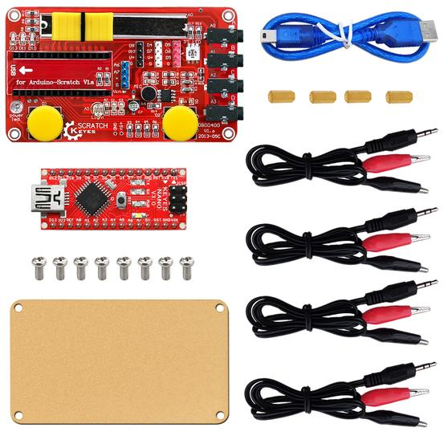

KEYES Scratch 元件包套件

# 1、说明

KEYES Scratch 元件包套件主要由Robotale scratch和一块keyes NANO等组成。Robotale scratch里面有滑动电阻器、按键、光敏电阻、和麦克风语音模块，结合S4A软件，我们可以通过利用读取的的传感器数值控制软件是的动画声音，从而实现不同交互式人机效果。我们还提供相关课程，让你轻松上手学习Scratch。
